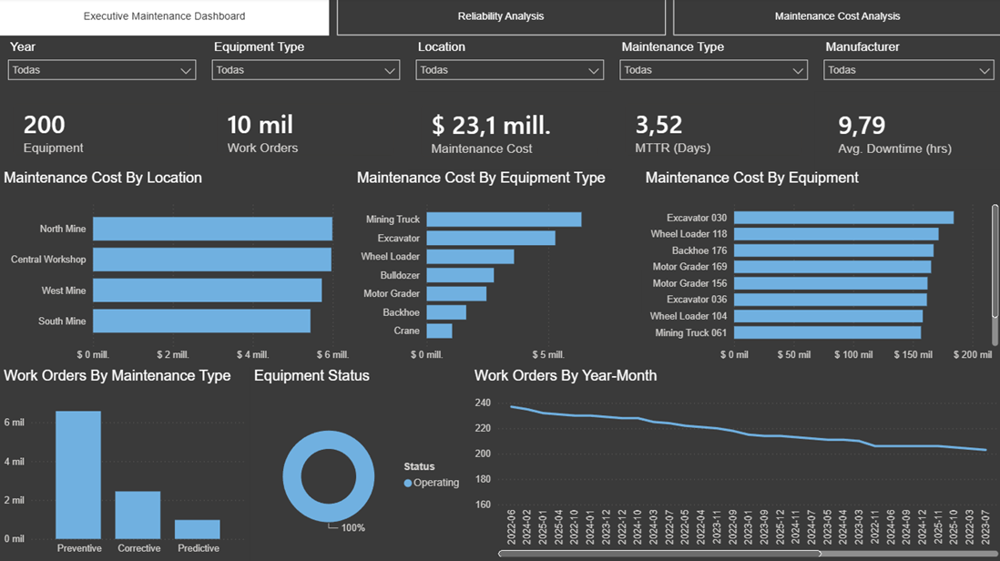
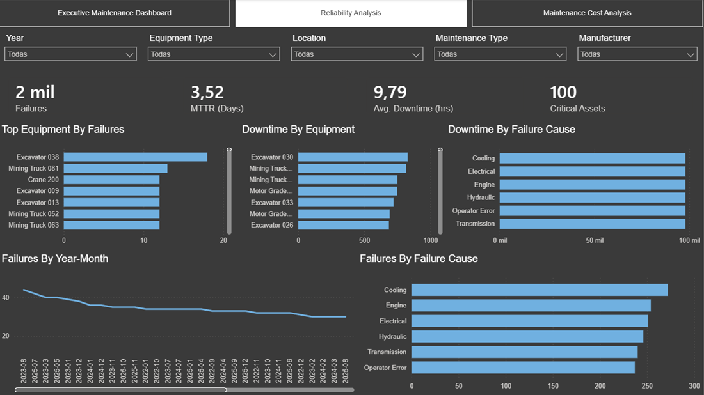
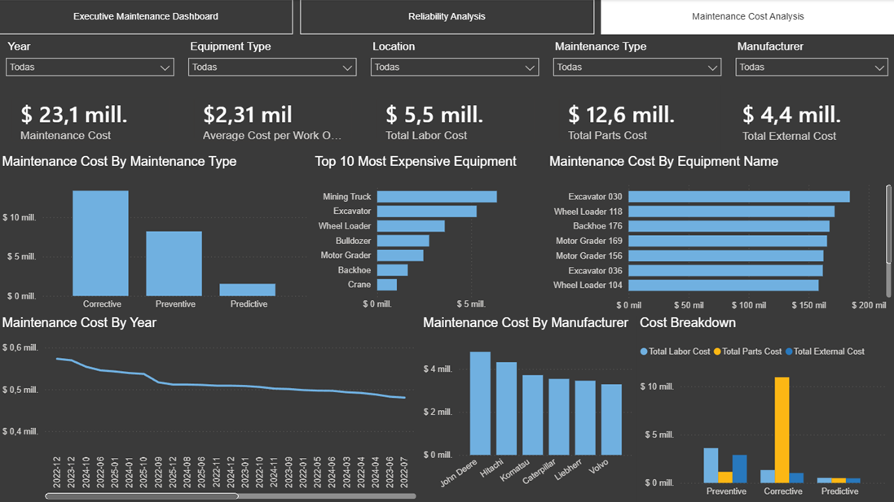

# Maintenance Reliability & Cost Analytics Dashboard

## Overview

This project showcases an interactive Power BI dashboard designed to monitor maintenance operations, equipment reliability, downtime, and maintenance costs for an industrial fleet.

The dashboard helps maintenance managers and reliability engineers identify high-cost assets, analyze failure patterns, monitor KPIs, and improve maintenance decision-making.

---

## Dashboard Pages

### 1. Executive Maintenance Dashboard

Provides an overview of maintenance operations including:

- Total Equipment
- Total Work Orders
- Maintenance Cost
- MTTR
- Average Downtime
- Maintenance Cost by Equipment Type
- Maintenance Cost by Location
- Equipment Status
- Monthly Work Orders

---

### 2. Reliability Analysis

Focused on equipment reliability.

Includes:

- Total Failures
- MTTR
- Downtime Analysis
- Critical Assets
- Failure Trend
- Top Equipment by Failures
- Downtime by Equipment
- Failure Cause Analysis

---

### 3. Maintenance Cost Analysis

Financial view of maintenance operations.

Includes:

- Maintenance Cost
- Average Cost per Work Order
- Labor Cost
- Parts Cost
- External Service Cost
- Top 10 Most Expensive Equipment
- Maintenance Cost by Manufacturer
- Maintenance Cost by Maintenance Type
- Cost Breakdown

---

## Dataset

The project uses a simulated industrial maintenance dataset including:

- Equipment
- Work Orders
- Failures
- Technicians
- Maintenance Types
- Locations
- Failure Causes

---

## Skills Demonstrated

- Power BI
- DAX
- Data Modeling
- Star Schema
- KPI Design
- Maintenance Analytics
- Reliability Engineering
- Dashboard Design
- Data Visualization

---

## Author

Jeffry Rico

Mechanical Engineer | Data Analyst | Power BI Developer
